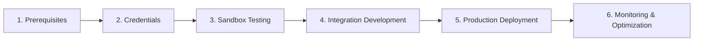

# RBIH Developer Portal

Welcome to the **Reserve Bank Innovation Hub (RBIH) Developer Portal** - your comprehensive guide to integrating with India's most advanced financial and identity verification APIs.

## What is RBIH?

The Reserve Bank Innovation Hub (RBIH) is a wholly-owned subsidiary of the Reserve Bank of India (RBI), established to promote innovation in the financial sector. RBIH provides a unified platform offering cutting-edge APIs for identity verification, financial services, land records, and agricultural intelligence.

**Vision**: *Frictionless Finance for a Billion Indians™*

## Platform Overview

RBIH offers 15+ production-ready APIs across multiple categories, serving banks, NBFCs, fintech companies, and government entities with secure, scalable, and compliant solutions.

### 🏗️ Architecture
- **Multi-cloud deployment** with 99.9% uptime SLA
- **Microservices architecture** for scalability and resilience  
- **API-first design** with comprehensive OpenAPI specifications
- **Real-time and asynchronous processing** capabilities

### 🔒 Security & Compliance
- **RBI-compliant** security frameworks
- **Enterprise-grade encryption** (AES-256, TLS 1.3)
- **Multi-factor authentication** and IP whitelisting
- **Comprehensive audit trails** and monitoring

## API Categories

### [Identity & Verification Services](/docs/next/rbih-apis#identity--verification-services)
Comprehensive identity verification solutions for KYC and onboarding:

- **Aadhaar Redact Service** - Secure redaction of Aadhaar numbers from documents
- **Document Verification** - Driving license, voter ID, and other government document verification  
- **Facematch Service** - Biometric identity verification through facial comparison
- **Identity Verification** - Multi-endpoint verification including name/address matching
- **PAN Verification** - Real-time PAN validation against Income Tax records
- **Voter ID Verification** - Electoral identity verification across Indian states

### [Financial Services](/docs/next/rbih-apis#financial-services)
Banking and financial data services for lending and risk assessment:

- **Bank Account Verification** - Real-time account validation without transactions
- **GSTN Service** - GST-related financial information via Account Aggregator framework
- **Account Aggregator** - Centralized financial data aggregation from multiple institutions

### [Land Records Services](/docs/next/rbih-apis#land-records-services)
Property and land verification for secured lending:

- **LRS Owner Details** - Land ownership verification across 9 Indian states
- **LRS Lien Marking** - Digital lien creation and management with state integration

### [Agricultural Services](/docs/next/rbih-apis#agricultural-services)
Advanced agricultural intelligence for rural and agri-lending:

- **Farm Yield & MultiLand Parcel** - Satellite-powered crop analysis and yield predictions across 5 states

### [Other Services](/docs/next/rbih-apis#other-services)
Specialized services for enhanced functionality:

- **Translation & Transliteration** - Multi-language support for 6 Indian languages via Bhashini
- **Legal Verification** - Comprehensive legal background checks from court systems

## Quick Start Guide

### 1. Prerequisites Setup
```bash
# Required before API integration
✓ IP Whitelisting (both client and server IPs)
✓ Platform Credentials (Client ID, Secret, Provider Codes)  
✓ Service Subscriptions via Dev Portal
✓ SSL Certificates for production
```

### 2. Authentication Setup
```javascript
// JWT Token Generation Example
const jwt = require('jsonwebtoken');

const generateToken = (clientId, clientSecret, providerId) => {
  const payload = {
    iss: clientId,
    sub: 'api_access', 
    provider: providerId,
    exp: Math.floor(Date.now() / 1000) + (6 * 60 * 60) // 6 hours
  };
  return jwt.sign(payload, clientSecret, { algorithm: 'HS256' });
};
```

### 3. Environment Configuration
| Environment | Token Validity | Base URL | Purpose |
|-------------|---------------|----------|---------|
| **Sandbox** | 6 hours | `https://sandbox.rbihapis.com` | Development & Testing |
| **Production** | 6 hours | `https://api.rbihapis.com` | Live Operations |

### 4. First API Call
```javascript
// Example: PAN Verification
const response = await fetch('https://api.rbihapis.com/pan/verify', {
  method: 'POST',
  headers: {
    'Authorization': `Bearer ${jwtToken}`,
    'Content-Type': 'application/json',
    'client-id': clientId,
    'provider': '101'
  },
  body: JSON.stringify({
    panNumber: 'ABCDE1234F',
    nameToMatch: 'John Doe'
  })
});
```

## Developer Resources

### 📖 Documentation
- **[Authentication & Security](./authentication/authentication-overview)** - JWT tokens, encryption, and security best practices
- **[Error Handling](./error-handling/error-handling-overview)** - Comprehensive error codes and troubleshooting guide
- **[Rate Limiting & Performance](./performance/performance-overview)** - Optimization strategies and rate limit management
- **[Security & Compliance](./security-compliance)** - Data protection and regulatory compliance

### 🛠️ API Reference
- **[Complete API Catalog](/docs/next/rbih-apis)** - Full OpenAPI specifications for all 13 services
- **[Interactive API Explorer](/docs/next/rbih-apis)** - Test APIs directly in the documentation
- **Code Examples** - Implementation samples in JavaScript, Python, cURL, and more

### 🚀 Quick Start Resources
- **[Getting Started Guide](./authentication/authentication-overview)** - Complete setup and authentication guide
- **[Sandbox Environment](./authentication/environments)** - Full-featured testing environment
- **[Error Troubleshooting](./error-handling/common-errors)** - Common issues and solutions
- **[Performance Tips](./performance/performance-overview)** - Optimization strategies and best practices

## Environment URLs

### Sandbox (Development & Testing)
```
Authentication: https://auth.nonprod.rbihub.io/
Dev Portal:     https://am.nonprod.rbihub.io/devportal  
API Gateway:    https://extgw.nonprod.rbihub.io/
```

### Production (Live Operations)
```
Authentication: https://auth.api.rbihub.io/
Dev Portal:     https://am.api.rbihub.io/devportal
API Gateway:    https://extgw.api.rbihub.io/
```

## Integration Workflow



1. **Prerequisites Setup** - IP whitelisting, service subscriptions
2. **Credential Configuration** - JWT setup, provider codes  
3. **Sandbox Testing** - API exploration and testing
4. **Integration Development** - Build your application integration
5. **Production Deployment** - Go live with proper monitoring
6. **Monitoring & Optimization** - Performance tracking and optimization

## Support & Community

### Technical Support
- **Email**: [support@rbihub.io](mailto:support@rbihub.io)
- **Response Time**: Within 2 hours (8 AM - 8 PM IST)
- **Escalation**: 24/7 support for production issues

### Developer Resources
- **GitHub**: Code samples and SDKs
- **Developer Community**: Technical discussions and best practices
- **Webinars**: Regular training sessions and API updates

### What to Include in Support Requests
```
✓ Service name and version
✓ Environment (Sandbox/Production) 
✓ Request/response headers and payload
✓ Error codes and timestamps
✓ Prerequisites status (IP whitelisting, subscriptions)
```

## Next Steps

### 🎯 For New Developers
1. **[📖 Read Getting Started](./authentication/authentication-overview)** - Essential setup and authentication
2. **[🔍 Explore API Catalog](/docs/next/rbih-apis)** - Browse all 13 available services  
3. **[🧪 Try Sandbox Environment](./authentication/environments)** - Test with sample data
4. **[⚠️ Handle Errors Gracefully](./error-handling/error-handling-overview)** - Robust error handling

### 🚀 For Production Deployment
1. **[🔒 Security Best Practices](./authentication/best-practices)** - Enterprise security guidelines
2. **[⚡ Performance Optimization](./performance/performance-overview)** - Rate limiting and scaling
3. **[📋 Compliance Requirements](./security-compliance)** - Regulatory compliance checklist
4. **[🎯 Go Live Checklist](./authentication/environments)** - Production deployment guide

---

**Ready to build the future of financial services?** 

👉 **New to RBIH?** Start with our [**Getting Started Guide**](./authentication/authentication-overview)  
👉 **Ready to integrate?** Explore our [**API Catalog**](/docs/next/rbih-apis)  
👉 **Need help?** Check our [**Error Troubleshooting Guide**](./error-handling/common-errors)
